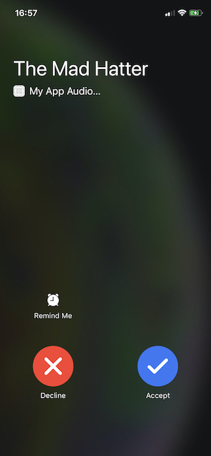
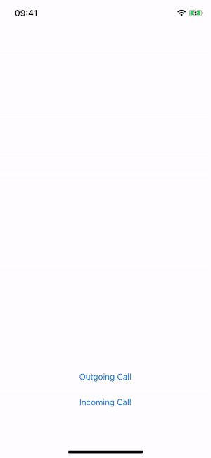

# CallKit UI experiments 

Quick test of CallKit UI. All the app does at the moment it shows native incoming call screen when *Incoming Call* button is pressed.

 

This is what will be shown to to the callee if the caller is not identified. If the caller is identified that the screen will look as it shown below:

Since it's sample project the incoming call is faked but in the real application we will need to use [Call Directory Extension](https://developer.apple.com/documentation/callkit) to identify caller. One important thing to keep in mind that the caller should be in the Contacts app with picture to be shown.  

It also makes attempt to show outgoing call but it's shown only on the lock screen.

## Nest step

1. Investigate how much incoming screen is customizable?
2. Is there a native screen for an outgoing screen?
3. What kind of certificate is required for PushKit

